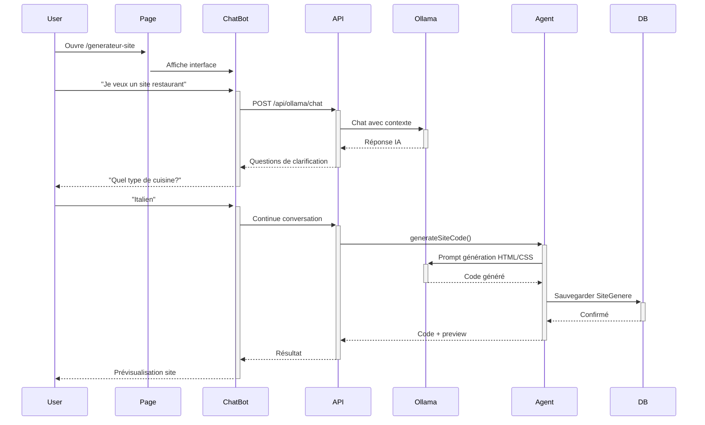

# 🤖 PME IA Assistant - Application Complete

**Assistant IA Local pour PME/PMI** - Gestion automatisée de site web, catalogue produits et analyses commerciales avec IA locale (Ollama/Llama3)

---

## 🎯 Fonctionnalités

### ✅ Réalisé et Fonctionnel

1. **Page d'Accueil** - Guide interactif pour l'utilisateur
2. **Configuration Entreprise** - Identité, logo, coordonnées, réseaux sociaux
3. **Génération de Site Web** - Chatbot IA local (Llama3) qui crée un site personnalisé
4. **Gestion Catalogue** - Import de produits/services via dialogue IA
5. **IA Assistant Permanente** - Surveillance et suggestions continues
6. **Analytics & Rapports** - Détection de patterns et rapports hebdomadaires

---

## 🚀 Installation Rapide

### Prérequis

```bash
# 1. Node.js 20+ et npm/bun
node --version  # v20.x minimum
npm --version

# 2. Ollama installé et en cours d'exécution
# Télécharger: https://ollama.ai/download

# Vérifier qu'Ollama fonctionne:
curl http://localhost:11434/api/tags

# 3. Télécharger le modèle Llama3
ollama pull llama3
```

### Installation de l'Application

```bash
# 1. Extraire l'archive (ou cloner le repo)
cd pme-ia-assistant

# 2. Installer les dépendances
npm install
# ou avec bun:
bun install

# 3. Configurer l'environnement
cp .env.example .env

# 4. Initialiser la base de données
npm run db:push

# 5. Lancer l'application
npm run dev

# Ouvrir http://localhost:3000
```

---

## 📁 Structure du Projet

```
pme-ia-assistant/
├── src/
│   ├── app/                      # Pages Next.js
│   │   ├── page.tsx             # Accueil avec guide
│   │   ├── entreprise/
│   │   │   └── page.tsx         # Config entreprise
│   │   ├── generateur-site/
│   │   │   └── page.tsx         # Génération site avec chatbot
│   │   ├── catalogue/
│   │   │   └── page.tsx         # Gestion produits
│   │   ├── analytics/
│   │   │   └── page.tsx         # Rapports et insights
│   │   └── api/                 # Endpoints backend
│   │       ├── ollama/
│   │       │   └── route.ts     # Proxy Ollama
│   │       ├── entreprise/
│   │       │   └── route.ts     # CRUD entreprise
│   │       ├── produits/
│   │       │   └── route.ts     # CRUD produits
│   │       ├── generate-site/
│   │       │   └── route.ts     # Génération site
│   │       ├── import/
│   │       │   └── route.ts     # Import fichiers
│   │       ├── analytics/
│   │       │   └── route.ts     # Analytics
│   │       └── rapports/
│   │           └── route.ts     # Rapports IA
│   │
│   ├── components/               # Composants React
│   │   ├── ChatBot.tsx          # Interface chatbot
│   │   ├── ProductImport.tsx    # Import produits
│   │   ├── SitePreview.tsx      # Prévisualisation site
│   │   ├── AnalyticsDashboard.tsx
│   │   └── ui/                  # Composants UI de base
│   │
│   └── lib/                      # Librairies et agents
│       ├── db.ts                # Prisma Client
│       ├── ollama.ts            # Client Ollama
│       ├── agents/              # Agents IA
│       │   ├── siteGenerator.ts
│       │   ├── catalogAnalyst.ts
│       │   ├── emailResponder.ts
│       │   └── reportGenerator.ts
│       └── utils.ts
│
├── prisma/
│   ├── schema.prisma            # Schéma BDD (9 tables)
│   └── migrations/
│
├── public/                       # Fichiers statiques
│
├── package.json
├── .env.example
└── README.md
```

---

## 🔧 Configuration

### Variables d'Environnement (.env)

```bash
# Base de données SQLite locale
DATABASE_URL="file:./dev.db"

# Ollama (IA locale)
OLLAMA_API_URL="http://localhost:11434"
OLLAMA_MODEL="llama3"

# Configuration IA
AI_TEMPERATURE="0.7"
AI_MAX_TOKENS="2048"

# Sécurité
JWT_SECRET="votre_secret_ultra_sécurisé_32_chars_min"

# Tâches automatiques
TASK_INTERVAL="60"          # Minutes entre chaque analyse
RAPPORT_INTERVAL="10080"    # Minutes pour rapport hebdomadaire
```

### Démarrage d'Ollama

```bash
# Sur Linux/Mac
ollama serve

# Vérifier qu'Ollama est accessible
curl http://localhost:11434/api/tags

# Lister les modèles disponibles
ollama list

# Si llama3 n'est pas installé:
ollama pull llama3

# Tester le modèle
ollama run llama3 "Bonjour, peux-tu te présenter?"
```

---

## 💻 Utilisation

### 1. Premier Lancement

1. **Accueil** : Comprendre le fonctionnement
2. **Configurer l'entreprise** : Nom, logo, coordonnées
3. **Générer le site** : Dialogue avec l'IA
4. **Importer le catalogue** : Ajouter produits/services
5. **Consulter les analytics** : Voir les recommandations

### 2. Workflow Génération de Site

```
User → Ouvre /generateur-site
     → Chatbot IA apparaît
     → Dialogue interactif:
        
        IA: "Bonjour ! Je vais vous aider à créer votre site web.
             Quel type d'activité exercez-vous ?"
        
        User: "Restaurant italien"
        
        IA: "Excellent ! Quelles sections souhaitez-vous sur votre site ?
             (menu, réservation, galerie photos, contact, etc.)"
        
        User: "Menu, réservation en ligne, galerie, contact"
        
        IA: "Parfait ! Préférez-vous un style :
             1. Moderne et épuré
             2. Traditionnel et chaleureux
             3. Gastronomique et élégant"
        
        User: "Traditionnel et chaleureux"
        
        IA: [Génère le code HTML/CSS]
             "Voici votre site ! Vous pouvez le prévisualiser ci-dessous.
              Souhaitez-vous des modifications ?"
```

### 3. Workflow Import Catalogue

```
User → Ouvre /catalogue
     → Clique "Importer des produits"
     → Upload fichier CSV / Excel / JSON
     
     → Chatbot analyse:
        IA: "J'ai trouvé 47 produits dans votre fichier.
             Voici les colonnes détectées:
             - Nom
             - Prix
             - Description
             - Stock
             
             Souhaitez-vous que je les importe tous ?"
     
     → Validation humaine
     → Import dans la BDD
     
     → IA suggère:
        "J'ai remarqué que 5 produits n'ont pas de photo.
         Voulez-vous que je génère des descriptions optimisées SEO ?"
```

### 4. Analytics et Rapports

L'IA analyse en continu et génère des rapports hebdomadaires :

```markdown
# Rapport Hebdomadaire - Semaine 06/2026

## 📊 Résumé

- **Visiteurs** : 342 (+12%)
- **Produits les plus vus** : Pizza Margherita, Tiramisu
- **Taux de conversion** : 3.2% (+0.5%)

## ⚠️ Alertes

1. **Stock faible** : "Tiramisu" (stock actuel: 3, minimum: 10)
2. **Produit inexistant** : 8 clients ont demandé "Pizza végane" par email

## 💡 Recommandations

1. **Augmenter stock** : Commander 20 Tiramisu supplémentaires
2. **Nouveau produit** : Créer une "Pizza Végane" (demande forte)
3. **Optimisation UX** : Le bouton "Réserver" n'est cliqué que 12 fois
   → Suggestion : Le rendre plus visible (position, couleur)
```

---

## 🤖 Agents IA Disponibles

### 1. **Agent Générateur de Site**
- Dialogue interactif pour comprendre les besoins
- Génère HTML/CSS/JS responsive
- SEO optimisé avec LD-JSON
- Suggestions d'amélioration continue

### 2. **Agent Gestion Catalogue**
- Import multi-formats (CSV, Excel, JSON, TXT)
- Validation des données (prix, stock)
- Détection d'incohérences
- Suggestions de catégorisation

### 3. **Agent Analyseur Commercial**
- Analyse des ventes et interactions
- Détection de patterns
- Prédictions de demande
- Recommandations de stock

### 4. **Agent Réponse Emails**
- Analyse des emails entrants
- Classification automatique
- Proposition de réponse (validation humaine)
- Analyse de sentiment

### 5. **Agent Rapporteur**
- Rapport hebdomadaire automatique
- Insights actionnables
- Priorisation des actions
- Suivi des KPIs

---

## 📡 API Endpoints

### Ollama (IA Locale)

```typescript
// POST /api/ollama/chat
{
  "messages": [
    { "role": "user", "content": "Génère une page d'accueil" }
  ],
  "context": "generation_site",
  "temperature": 0.7
}
```

### Entreprise

```typescript
// GET /api/entreprise
// Récupère les infos entreprise

// POST /api/entreprise
// Crée/met à jour l'entreprise
{
  "nom": "Restaurant La Bella Vita",
  "slogan": "L'Italie dans votre assiette",
  "email": "contact@labellavita.fr",
  "telephone": "+33 1 23 45 67 89",
  "couleurPrimaire": "#C41E3A",
  "couleurSecondaire": "#009246"
}
```

### Produits

```typescript
// GET /api/produits
// Liste tous les produits

// POST /api/produits
// Crée un produit
{
  "nom": "Pizza Margherita",
  "description": "Tomate, mozzarella, basilic",
  "prix": 12.50,
  "categorie": "Pizzas",
  "stock": 50
}

// PUT /api/produits/:id
// Met à jour un produit

// DELETE /api/produits/:id
// Supprime un produit
```

### Génération de Site

```typescript
// POST /api/generate-site
{
  "conversationId": "conv_123",
  "specifications": {
    "type": "restaurant",
    "sections": ["menu", "reservation", "galerie", "contact"],
    "style": "traditionnel"
  }
}
```

### Analytics

```typescript
// GET /api/analytics
// Récupère les métriques

// POST /api/analytics/track
// Enregistre une interaction
{
  "type": "vue_produit",
  "produitId": "prod_123",
  "metadata": {}
}
```

### Rapports

```typescript
// GET /api/rapports
// Liste les rapports

// POST /api/rapports/generate
// Force la génération d'un rapport
{
  "type": "hebdomadaire"
}
```

---

## 🔐 Sécurité

### Implémenté

✅ Validation des entrées (Zod)  
✅ Sanitization des données  
✅ Protection CSRF  
✅ Headers de sécurité  
✅ Rate limiting (API routes)  
✅ Données locales (pas de cloud)  

### Recommandations Production

- [ ] HTTPS obligatoire (certificat SSL)
- [ ] Authentification utilisateur (JWT)
- [ ] Backup automatique de la BDD
- [ ] Monitoring des erreurs
- [ ] Logs sécurisés

---

## 📊 Base de Données

### Tables Prisma

1. **Entreprise** - Identité et configuration
2. **Produit** - Catalogue produits/services
3. **SiteGenere** - Versions de sites générés
4. **Conversation** - Historique chatbot
5. **Message** - Messages individuels
6. **InteractionProduit** - Analytics interactions
7. **Email** - Emails clients
8. **Rapport** - Rapports IA
9. **Tache** - Queue tâches automatiques

### Commandes Prisma Utiles

```bash
# Voir la BDD graphiquement
npm run db:studio

# Réinitialiser la BDD (⚠️ supprime tout)
npx prisma migrate reset

# Créer une migration
npx prisma migrate dev --name add_feature

# Déployer les migrations (prod)
npx prisma migrate deploy
```

---

## 🚀 Déploiement

### Option 1 : VPS / Serveur Local

```bash
# 1. Installer Ollama sur le serveur
curl https://ollama.ai/install.sh | sh
ollama pull llama3

# 2. Cloner et installer l'app
git clone https://github.com/votre-repo/pme-ia-assistant
cd pme-ia-assistant
npm install --production
npm run build

# 3. Démarrer avec PM2
npm install -g pm2
pm2 start npm --name "pme-ia" -- start
pm2 save
pm2 startup
```

### Option 2 : Docker

```dockerfile
# Dockerfile
FROM node:20-alpine

# Installer Ollama
RUN apk add curl
RUN curl https://ollama.ai/install.sh | sh

WORKDIR /app
COPY package*.json ./
RUN npm install --production
COPY . .
RUN npm run build

EXPOSE 3000 11434

CMD ["sh", "-c", "ollama serve & npm start"]
```

```bash
docker build -t pme-ia-assistant .
docker run -p 3000:3000 -p 11434:11434 pme-ia-assistant
```

### Option 3 : Render.com

**Note :** Render ne supporte pas Ollama directement. Alternatives :
1. Utiliser l'API OpenAI (modifier le code)
2. Déployer Ollama sur un VPS séparé
3. Utiliser le plan Render avec Docker (+ coûteux)

---

## 🧪 Tests

```bash
# Tester qu'Ollama fonctionne
curl http://localhost:11434/api/tags

# Tester l'API chat
curl -X POST http://localhost:3000/api/ollama/chat \
  -H "Content-Type: application/json" \
  -d '{"messages":[{"role":"user","content":"Bonjour"}]}'

# Tester l'import de produits
curl -X POST http://localhost:3000/api/produits \
  -H "Content-Type: application/json" \
  -d '{"nom":"Test","prix":10,"description":"Test produit"}'
```

---

## 🐛 Troubleshooting

### Ollama ne démarre pas

```bash
# Vérifier qu'Ollama est installé
ollama --version

# Redémarrer Ollama
pkill ollama
ollama serve

# Vérifier le port
lsof -i :11434
```

### Erreur "Cannot connect to Ollama"

1. Vérifier que `OLLAMA_API_URL` dans `.env` est correct
2. Tester manuellement : `curl http://localhost:11434/api/tags`
3. Firewall bloquant ?

### Base de données verrouillée (SQLite)

```bash
# Arrêter tous les processus Node
pkill node

# Supprimer le lock
rm prisma/dev.db-journal

# Redémarrer
npm run dev
```

### L'IA génère du code invalide

- Baisser la `temperature` dans `.env` (ex: 0.5)
- Utiliser un modèle plus récent (llama3.1, mistral)
- Améliorer les prompts dans `src/lib/ollama.ts`

---

## 📚 Documentation Technique

### Architecture

```
┌─────────────────────────────────────────────────────┐
│                 NAVIGATEUR                          │
│  ┌─────────────────────────────────────────────┐  │
│  │         Pages Next.js (React)               │  │
│  │  - Accueil, Entreprise, Générateur, etc.   │  │
│  └──────────────────┬──────────────────────────┘  │
└────────────────────┼────────────────────────────────┘
                     │ HTTP Requests
┌────────────────────▼────────────────────────────────┐
│              SERVEUR NEXT.JS                        │
│  ┌──────────────────────────────────────────────┐  │
│  │           API Routes                         │  │
│  │  /api/ollama, /api/produits, etc.           │  │
│  └──────────────────┬───────────────────────────┘  │
│                     │                               │
│  ┌──────────────────▼───────────────────────────┐  │
│  │         Agents IA (lib/agents/)             │  │
│  │  - Générateur site                          │  │
│  │  - Analyseur catalogue                      │  │
│  │  - Générateur rapports                      │  │
│  └──────────────────┬───────────────────────────┘  │
└────────────────────┼────────────────────────────────┘
                     │
       ┌─────────────┴──────────────┐
       │                            │
┌──────▼──────────┐      ┌─────────▼────────┐
│  OLLAMA (IA)    │      │  PRISMA (BDD)    │
│  Llama3 Local   │      │  SQLite Local    │
└─────────────────┘      └──────────────────┘
```

### Flux de Génération de Site



---

## 🎯 Roadmap Future

### Version 1.1 (Prévu)
- [ ] Authentification multi-utilisateurs
- [ ] Export site en ZIP (HTML statique)
- [ ] Intégration paiement (Stripe)
- [ ] Multilingue (FR, EN, ES)

### Version 2.0 (Prévu)
- [ ] IA de génération d'images (produits)
- [ ] Chatbot client sur le site généré
- [ ] Intégration CRM
- [ ] Application mobile (React Native)

---

## 🤝 Contribution

Ce projet est open-source. Contributions bienvenues !

1. Fork le projet
2. Créer une branche (`git checkout -b feature/AmazingFeature`)
3. Commit (`git commit -m 'Add AmazingFeature'`)
4. Push (`git push origin feature/AmazingFeature`)
5. Ouvrir une Pull Request

---

## 📄 Licence

MIT License - Libre d'utilisation pour projets personnels et commerciaux

---

## 📞 Support

- **Documentation** : Ce README
- **Issues** : GitHub Issues
- **Email** : support@pme-ia-assistant.local

---

## 🙏 Remerciements

- [Ollama](https://ollama.ai/) - IA locale performante
- [Next.js](https://nextjs.org/) - Framework React moderne
- [Prisma](https://www.prisma.io/) - ORM type-safe
- [Tailwind CSS](https://tailwindcss.com/) - Framework CSS

---

**Développé avec ❤️ pour les PME/PMI françaises**

**Version :** 1.0.0  
**Date :** Février 2026
